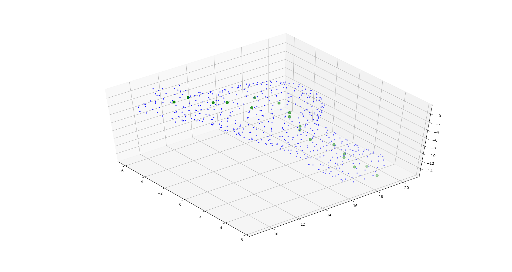

# Analyzing Blood Vessel Aneurysm

This repository contains **only the code** used to extract positional data from the stl file provided.
The process is split up into 4 steps.

- Step 1: Parse the stl file, and reduce it to a csv
- Step 2: Use Mean Shift clustering to identify various groupings in data
- Step 3: List groupings that contain high diameters, then select the highest diameter groupings
- Step 4: Use mean-shift to lower the resolution of the selected grouping
- Step 5: Attempt to generate a centroid line using a thinning algo

## How to use
Extract `vessels.stl.zip` into `data/` as `data/00_vessel.stl`.
Then run (in order)

```
    python step_01.py
    python step_02.py
    python step_03.py
    python step_04.py
    python step_05.py
```


## Output
The final output will be placed in `data/`. However, I have moved the final output (step_05) and the low-resolution data (for easier plotting, it is produced in step_04). Below you can see an image of the final results


